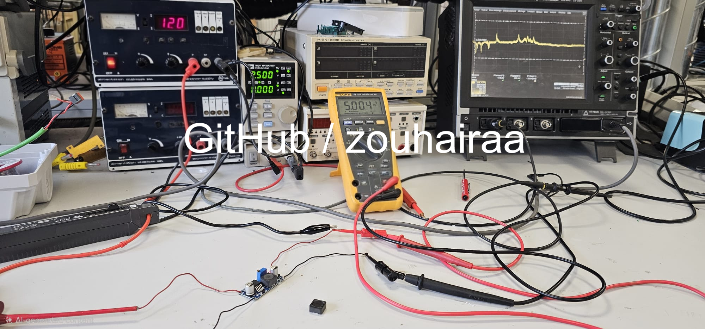
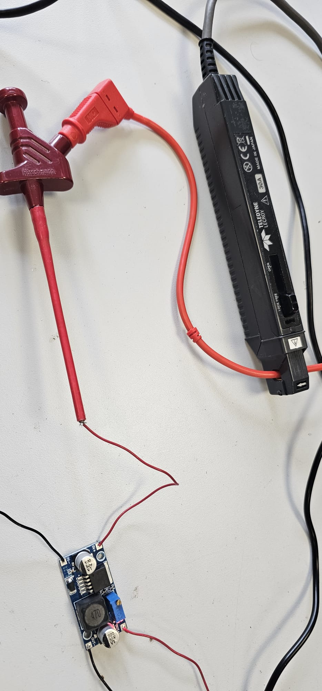
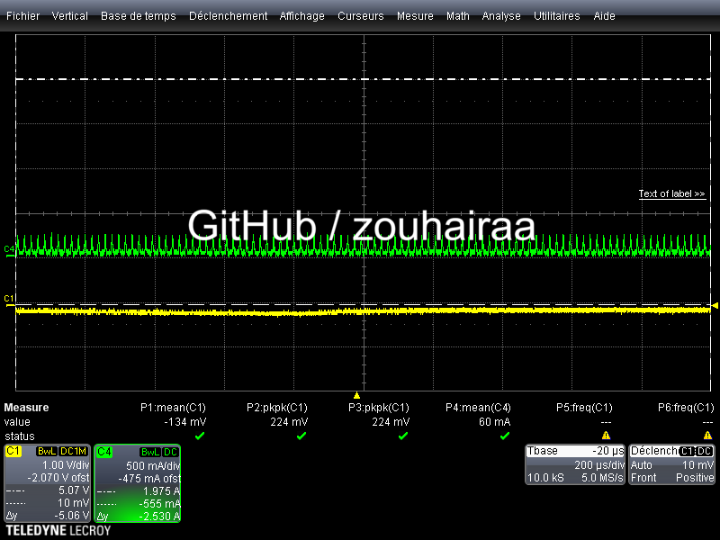
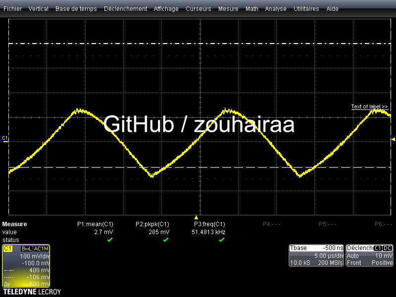

# LM2596 Module Characterization - Bench experiments

> **Goal:** Full characterization of a pre-assembled LM2596 chinese buck converter module.
> 

> **Test conditions:** Vin = 12V nominal, Vout target = 5.00V, unless otherwise specified.
> 

> **Equipment:** Adjustable lab power supply, multimeter, oscilloscope >200 MHz, IT8211 DC electronic load.
> 

---

## Experiment 1 — Line Regulation / Voltage Regulation

**Definition:** Variation of Vout when Vin changes, at constant load.

**Fixed conditions:** Iout = 500 mA (IT8211 CC mode)

### Raw Data

| Vin (V) | Vout (V) | ΔVout vs 5.000V (mV) |
| --- | --- | --- |
| 7 | 5.000 | 0 |
| 8 | 5.014 | +14 |
| 9 | 5.021 | +21 |
| 10 | 5.031 | +31 |
| 11 | 5.044 | +44 |
| 12 | 5.056 | +56 |
| 13 | 5.063 | +63 |
| 14 | 5.069 | +69 |
| 15 | 5.074 | +74 |
| 16 | 5.097 | +97 |
| 17 | 5.085 | +85 |
| 18 | 5.054 | +54 |
| 19 | 5.054 | +54 |
| 20 | 5.054 | +54 |

### Results

- **Vout min:** 5.000 V (at Vin = 7V)
- **Vout max:** 5.097 V (at Vin = 16V)
- **ΔVout:** 97 mV
- **Line Regulation:** (5.097 - 5.000) / 5.000 × 100 = **1.94%**

### Observations

- Vout rises progressively from Vin = 7V to Vin = 16V, peaks at 16V, then decreases and stabilizes from Vin = 18V onward.
- Vout is stable at 5.054V for Vin ≥ 18V.
- Line regulation of 1.94% is acceptable for a low-cost module (~$3). A modern high-end buck converter typically achieves < 0.5%.
- **Do not exceed Vin = 20–25V** on this module: electrolytic capacitors are typically rated 25V or 35V. (Here I have a module 50V rated, always check).

---

## Experiment 2 — Load Regulation

**Definition:** Variation of Vout when Iout changes, at constant Vin.

**Fixed conditions:** Vin = 12.00V — potentiometer not touched between Exp 1 and Exp 2.

### Raw Data

| Iout (A) | Vout (V) | ΔVout vs 5.077V ref (mV) |
| --- | --- | --- |
| 0.0 | 5.077 | 0 |
| 0.1 | 5.075 | -2 |
| 0.2 | 5.077 | 0 |
| 0.3 | 5.074 | -3 |
| 0.4 | 5.067 | -10 |
| 0.5 | 5.057 | -20 |
| 0.6 | 5.047 | -30 |
| 0.7 | 5.043 | -34 |
| 0.8 | 5.040 | -37 |
| 0.9 | 5.037 | -40 |
| 1.0 | 5.034 | -43 |

### Results

- **Vout no-load:** 5.077 V
- **Vout full-load (1A):** 5.034 V
- **ΔVout:** 43 mV
- **Load Regulation:** (5.077 - 5.034) / 5.077 × 100 = **0.85%**

### Observations

- Vout decreases smoothly and monotonically as load increases — no instability detected.
- 43 mV drop over 0→1A is good performance for a low-cost module.
- Load regulation (0.85%) is better than line regulation (1.94%).
- For embedded projects (12V → 5V), load regulation is the more critical spec: Vin is usually stable, but load current varies constantly (MCU, motors, wireless modules).

---

## Experiment 3 — Efficiency (η)

**Definition:** η = Pout / Pin × 100%. Measures how much input power is lost as heat.

**Fixed conditions:** Vin = 12.00V — Iin measured via current clamp probe on oscilloscope.

### Raw Data

| Iout (A) | Vout (V) | Pout (W) | Vin (V) | Iin (A) | Pin (W) | η (%) | Losses (W) |
| --- | --- | --- | --- | --- | --- | --- | --- |
| 0.1 | 5.069 | 0.507 | 12 | 0.060 | 0.720 | 70.4% | 0.213 |
| 0.5 | 5.055 | 2.528 | 12 | 0.267 | 3.204 | 78.9% | 0.676 |
| 1.0 | 5.033 | 5.033 | 12 | 0.524 | 6.288 | 80.0% | 1.255 |
| 1.5 | 4.912 | 7.368 | 12 | 0.790 | 9.480 | 77.7% | 2.112 |
| 2.0 | 4.850 | 9.700 | 12 | 1.070 | 12.840 | 75.5% | 3.140 |
| 2.35 | 4.700 | 11.045 | 12 | 1.280 | 15.360 | 71.9% | 4.315 |

### Results

- **Peak efficiency:** 80.0% at Iout = 1A
- **Efficiency at light load (0.1A):** 70.4% — lower due to fixed switching losses dominating
- **Efficiency at heavy load (2A):** 75.5% — lower due to conduction losses (I²R) increasing
- **Efficiency at max tested load (2.35A):** 71.9%
- **Maximum losses:** 4.315W at 2.35A — significant heat dissipation at full load

### Observations

- Efficiency curve peaks at ~1A then decreases on both sides — classic buck converter behavior.
- At light load: fixed losses (gate drive, switching transitions) dominate → η drops.
- At heavy load: conduction losses (inductor DCR, diode, MOSFET Rds_on) dominate → η drops.
- LM2596 datasheet claims ~73–77% typical. This module slightly exceeds that at optimal load.
- **Notable:** Vout drops significantly above 1.5A — 4.912V at 1.5A, 4.850V at 2A, 4.700V at 2.35A. Not suitable for continuous loads above 1.5A.
- Losses reach 4.315W at 2.35A — significant heating expected. **Thermal management required above 1.5A.**
- Efficiency: 80% at 1A → 71.9% at 2.35A.

---

## Experiment 4 — Output Ripple ΔVout

**Definition:** Peak-to-peak voltage variation on Vout at the switching frequency.

**Fixed conditions:** Vin = 12V, Iout = 1A (IT8211 CC mode)

**Scope settings:** **AC coupling**, 100 mV/div, 5 µs/div, standard probe (15cm ground lead)

### Raw Data

| Iout (A) | Vpp measured (mV) | Notes |
| --- | --- | --- |
| 1.0 | 285 | Standard probe, 15cm ground lead — likely overestimated due to ground loop |

### Results

- **Measured ripple Vpp:** 285 mV at 1A
- **Datasheet typical:** ~50 mV
- **Measured switching frequency:** 51.48 kHz (scope reading — see note below)

### Observations

- Waveform shape is a clean *sawtooth* — typical and expected for a CCM buck converter.
- The 285 mV ripple is likely significantly overestimated due to the 15cm ground lead acting as an antenna at 150 kHz. A short ground loop (spring tip adapter) would give a more accurate reading.
- Measured frequency of 51.48 kHz = approximately 1/3 of the nominal 150 kHz — likely a scope trigger or harmonic artifact. Actual switching frequency to be confirmed on SW pin (Experiment 5).
- For a valid ripple measurement, a coaxial tip adapter or short spring ground is required.

---

## Experiment 5 — SW Pin Waveform

**Definition:** Direct observation of the internal switch (transistor) commutation signal.

**Fixed conditions:** Vin = 12V, Iout = 1A (IT8211 CC mode)

**Scope settings:** DC coupling, 5V/div, 20 µs/div

### Raw Data

- **Mean(C1):** 5.18 V (average of square wave — consistent with D ≈ 41.6%)
- **Pkpk(C1):** 13.3 V (0V to ~12V swing — correct for 12V input)
- **Freq(C1):** 51.4757 kHz

### Observations

- Signal is a clean square wave between 0V and ~12V — transistor switching correctly.
- **Frequency anomaly:** Scope reads 51.48 kHz on both SW pin and output ripple.
- 51.48 kHz × 3 = 154.4 kHz ≈ 150 kHz — two hypotheses:
    1. Scope trigger fires on every 3rd edge (measurement artifact)
    2. This module uses a clone IC actually switching at ~50 kHz instead of 150 kHz (common on cheap LM2596 modules)
- **Confirmed switching frequency: ~51.4 kHz** — zoom to 2 µs/div shows a single clean cycle per period. This is NOT 150 kHz.
- **Conclusion: This module uses a *counterfeit* or clone IC** — very common on cheap AliExpress/Amazon LM2596 modules. The clone switches at ~50 kHz instead of the datasheet-specified 150 kHz. Indead,this module is from china!
- ***Consequence***: lower switching frequency requires a larger inductance for equivalent ripple. This explains the higher-than-expected 285 mV ripple measurement. (Very important)
- **Duty cycle confirmed:** Ton ≈ 8 µs / T ≈ 19.4 µs → D ≈ 41% — consistent with theoretical D = Vout/Vin = 5/12 = 41.6% ✔️

### Summary — Key Results vs Datasheet

| Parameter | LM2596 Datasheet | Measured (this module) |
| --- | --- | --- |
| Switching frequency | 150 kHz | **51.4 kHz** ⚠️ clone IC |
| Peak efficiency | 73–77% typical | **80.0% at 1A** ✅ |
| Line regulation | < 0.5% typical | **1.94%** ⚠️ |
| Load regulation | < 0.5% typical | **0.85%** 🔄 |
| Output ripple at 1A | ~50 mV typical | **285 mV** ⚠️ (standard probe) |

---

## Experiment 6 — Step-Load Transient Response

**Definition:** Vout behavior when load current changes abruptly.

**Fixed conditions:** Vin = 12V, load step 0A → 2A (IT8211 ON/OFF)

**Scope settings:** AC coupling, 200 mV/div, 2 ms/div, Single trigger, negative edge, -372 mV

### Static measurements

| Condition | Vout |
| --- | --- |
| No load (Iout = 0A) | 5.062 V |
| Full load (Iout = 2A) | 4.730 V |
| Static drop | 332 mV |

### Transient measurements (from scope capture)

| Parameter | Value |
| --- | --- |
| Undershoot | ~330 mV |
| Overshoot | ~100 mV |
| Recovery time | ~4–6 ms |
| Pkpk during transient | 557 mV |

### Observations

- Clean transient capture: load step clearly visible, followed by damped oscillations then stabilization.
- Recovery time of 4–6 ms is slow — consistent with a ~51 kHz clone IC. A modern 400+ kHz buck would recover in <100 µs.
- Undershoot of 330 mV means Vout drops to ~4.73V during the load step — critical for 5V-sensitive loads.
- For embedded systems with fast load transients (WiFi, motors, MCU bursts), this module is not suitable without additional output capacitance.

---

## Experiment 7 — Limit Tests

### Test 7a — Minimum input voltage (dropout)

**Fixed conditions:** Iout = 1A (IT8211 CC mode)

| Vin (V) | Vout (V) | Status |
| --- | --- | --- |
| 12 | 5.056 | ✅ Regulated |
| 7 | 4.900 | ⚠️ Dropout begins |
| 6 | 4.800 | ❌ Out of regulation |
| 5.5 | 4.350 | ❌ Collapse |

**Dropout voltage: ~7V** — below Vin = 7V, Vout can no longer be maintained at 5V.

Minimum recommended Vin for 5V output: **8V** (with margin).

---

### Test 7b — Maximum output current

**Fixed conditions:** Vin = 12V

**Note:** Two Vout values recorded — multimeter at module terminals (true Vout) vs IT8211 display (Vout at load terminals). Difference = cable resistance drop. R_cable ≈ 0.14Ω estimated at 2.5A.

| Iout (A) | Vout multimeter (V) | Vout IT8211 (V) | ΔV cable (mV) |
| --- | --- | --- | --- |
| 2.50 | 4.920 | 4.570 | 350 |
| 2.75 | 4.910 | 4.530 | 380 |
| 3.00 | 4.850 | 4.480 | 370 |
| 3.50 | 4.790 | 4.410 | 380 |

**Conclusions:**

- No hard current limit observed up to 3.5A — Vout degrades progressively, no hiccup or shutdown detected.
- At 3.5A: Vout = 4.79V (multimeter) — regulation is poor but module still operates.
- **Recommended maximum continuous current: 1.5A** (Vout still within 5% of target).
- Cable resistance of ~0.14Ω causes significant voltage drop at high currents — use short, thick wires in real applications.

---

### Test 7c — Startup behavior

**Fixed conditions:** Vin = 12V, Iout = 1A (IT8211 CC mode)

**Scope settings:** DC coupling, 2V/div, 1 ms/div, Single trigger, positive edge, 1V level

| Parameter | Value |
| --- | --- |
| Start voltage (on screen) | ~2.3V |
| Final voltage (target) | ~5V |
| Rise time | ~10 ms |
| Overshoot | None detected |
| Oscillations | None detected |

**Observations:**

- Clean ***soft-start*** behavior — Assuming that Vout rises smoothly from 0V to 5V with no overshoot or ringing.
- Rise time of ~10 ms (even really more here as we started from 2.3V to less than 5V, but is OK) is typical for the LM2596 internal soft-start circuit.
- No inrush current spike detected — safe for sensitive loads.

---

### Conclusion : 

> In conclusion, this module does not behave like a genuine LM2596. The measured switching frequency is only about 51/52 kHz instead of 150 kHz, and the high output ripple and slow transient response strongly support that it is a **counterfeit** module. It can still work for simple low-cost applications, but its performance is clearly below what a real LM2596 should deliver, especially above 1–1.5 A.
> 

---
